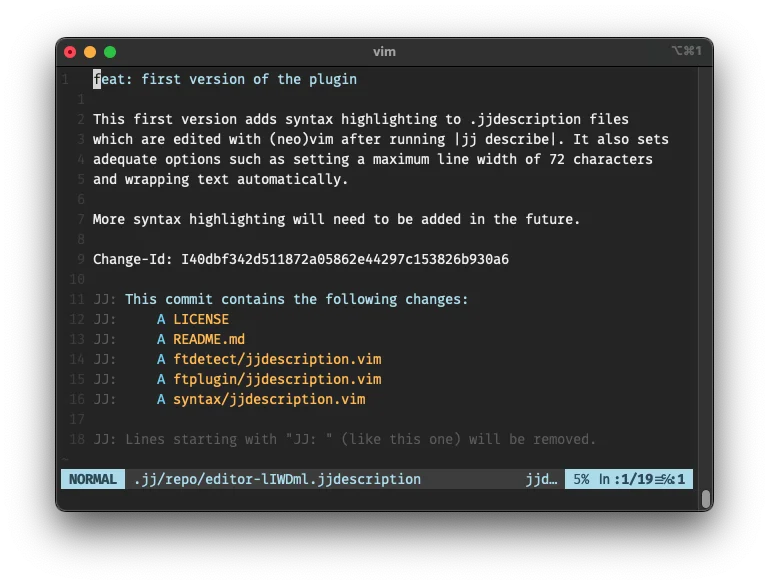

# .jjdescription files plugin for Vim
This plugin adds syntax highlighting and some sensible options for
.jjdescription files. These are temporary files created by [JJ][1] and opened
in your configured editor when you run `jj describe`, so you can write a
description for your change.



## Installation
Use your favorite plugin manager to install the `avm99963/vim-jjdescription`
plugin. For instance, with [vim-plug][2] you should add the following to the
appropriate section in your `.vimrc`:

``` vimscript
Plug 'avm99963/vim-jjdescription'
```

## Credits
This plugin is based on the native syntax highlighting and ftplugin for
gitcommit, which is the format of the analogous temporary files used by Git.
This is the reason why this plugin is licensed with the Vim license.

[1]: https://github.com/martinvonz/jj
[2]: https://github.com/junegunn/vim-plug
